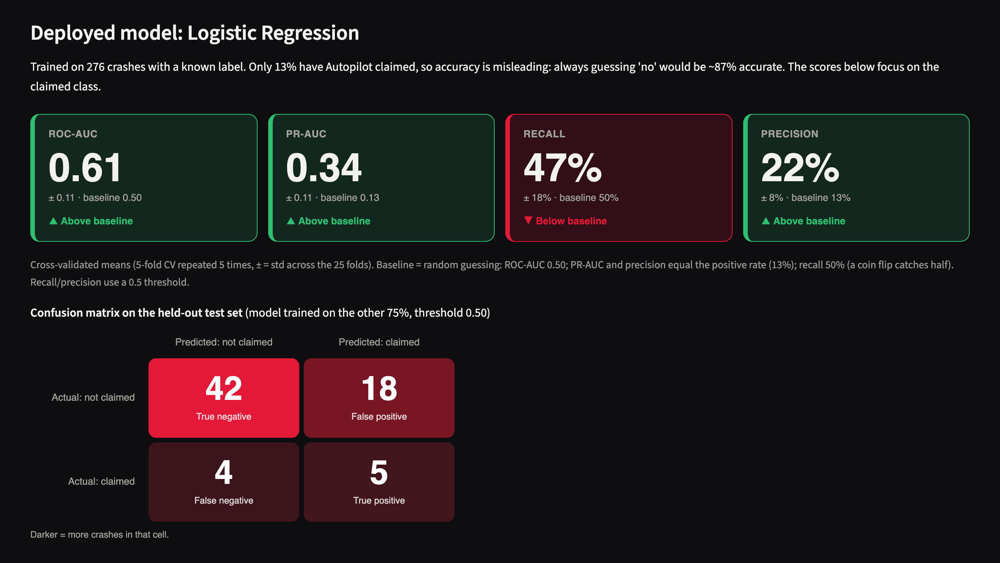

# Tesla Fatal Crashes: Predicting "Autopilot Claimed"

[](https://github.com/mijanjua/Tesla-Crash-ML/actions/workflows/tests.yml)
[](https://tesla-autopilot-claims.streamlit.app/)

**Live demo:** https://tesla-autopilot-claims.streamlit.app/

An end-to-end machine learning project that predicts whether Autopilot was **claimed** to be active in a fatal Tesla crash, from when and where the crash happened, the car model, and who was killed.

It covers data cleaning, feature engineering, logistic regression and random forest models, evaluation (cross-validation, confusion matrices, ROC/PR curves, feature importance), and a Streamlit app.


## Project structure

```
data/Tesla Deaths - Deaths.csv   raw dataset
src/data.py                      cleaning + feature engineering (shared by everything)
src/train.py                     models, evaluation, saves the best model
notebooks/01_eda_and_model.ipynb step-by-step walkthrough with charts
app/streamlit_app.py             interactive prediction app
tests/                           pytest checks for cleaning, features and models
models/                          trained model + metrics used by the app
```

## Quick start

```bash
python -m venv venv
source venv/bin/activate
pip install -r requirements-dev.txt   # app-only: requirements.txt

python -m src.train                 # train both models, save the best
streamlit run app/streamlit_app.py  # open http://localhost:8501
pytest                              # run the tests
```

## Approach

- **Target:** `Autopilot claimed`. `-` is treated as "no", any count as "yes", and blank rows are excluded as unknown. That leaves 276 labelled crashes, 13% of them positive.
- **Features:** year, month, region, US state group, car model, death counts by victim type (Tesla driver, passengers, other vehicle, cyclists/pedestrians), a multi-fatality flag, and keyword flags from the description.
- **Leakage prevention:** the "Verified Autopilot" columns and description words such as "Autopilot" or "FSD" are excluded, because they reveal the answer.
- **Imbalance:** `class_weight="balanced"`, stratified splits, and models judged on PR-AUC, ROC-AUC, recall and precision rather than accuracy.

## Results

5-fold cross-validation repeated 5 times on the training set (mean ± std across 25 folds):

| Model | ROC-AUC | PR-AUC |
|---|---|---|
| Baseline (always "no") | 0.50 | 0.13 |
| Logistic Regression | 0.61 ± 0.11 | 0.35 ± 0.14 |
| Random Forest | 0.62 ± 0.10 | 0.29 ± 0.11 |

The app's **Model performance** tab shows the same numbers against a random-guessing baseline:



Both models on the held-out test set, from the notebook:


Logistic regression is the deployed model, chosen for the best PR-AUC. Its decision threshold is tuned to maximize F1 on out-of-fold predictions; the tuned value is 0.5, because balanced class weights already shift the probabilities. The signal is weak. The strongest feature is whether the car model was reported at all, which reflects how detailed the news reports were rather than how the car was driven.


### What else I tried

All variants were compared on the same 50 folds (5-fold CV repeated 10 times). Paired differences are much less noisy than comparing two averages.

| Change vs. deployed model | PR-AUC change | Folds where it's better |
|---|---|---|
| TF-IDF text model on the description (Autopilot/FSD words removed) | +0.018 | 64% |
| Stronger regularization (C=0.1) | +0.011 | 60% |
| Random forest instead of logistic regression | −0.056 | 40% |

The text model helps slightly but consistently. It wasn't adopted because the gain is small and it would make the app depend on free-text input.

## What the data shows


Rates vary by year and car model, but most groups are small, so the differences are noisy.

## Limitations

- Small dataset: about 35 positive cases, so every metric has wide uncertainty.
- The target records *claims* made in reports, not verified Autopilot use.
- The features describe the crash outcome, not the car's state, such as speed, road type or driver statements.

## Data

The dataset comes from the community-maintained Tesla Deaths spreadsheet (tesladeaths.com).
